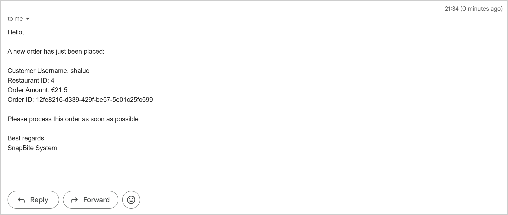

## SnapBite - Distributed Food Ordering System with Microservices

### Live Demo

[http://snapbite.online/](http://snapbite.online)

------

###  Project Overview

SnapBite is a cloud-based online food ordering system designed to streamline the ordering experience for both users and restaurant owners. The platform enables core functionalities such as restaurant browsing, dish selection, shopping cart management, order placement, and merchant-side order fulfillment.

The system adopts a microservices architecture, with each service independently deployed via Docker. Services communicate through REST APIs and RabbitMQ, while service discovery and API routing are handled using Eureka and Spring Cloud Gateway. SnapBite utilizes PostgreSQL for managing structured data like user accounts and orders, and MongoDB for handling unstructured data such as restaurant menus and shopping carts. Real-time email notifications are integrated to enhance system responsiveness and user engagement.

------

### Tech Stack

- **Frontend**: React, TypeScript, Tailwind CSS, Zustand, React Router, Axios
- **Backend**: Spring Boot, Spring Security, JWT (Json Web Token), Spring Cloud (Eureka, Gateway), RabbitMQ, Swagger (OpenAPI Docs)
- **Databases**: PostgreSQL (structured), MongoDB (unstructured)
- **Deployment & DevOps**: Docker, Docker Compose, GitHub Actions, Nginx, Watchtower
- **Infrastructure & Domain**: Contabo VPS (Cloud VPS 10 SSD), Namecheap (custom domain)

------

###  System Architecture

The **SnapBite** system is a distributed food ordering platform built using a microservices architecture. It consists of a React-based frontend, multiple Spring Boot backend services, and supporting middleware for communication and deployment.

- **Client requests** are routed through **Nginx**, which serves the static React frontend and forwards API requests to the **Spring Cloud Gateway**.
- The **API Gateway** handles routing to backend services and integrates with **Eureka Server** for service discovery and load balancing.
- Core services include:
  - `user-service`: Manages user registration, login, and authentication.
  - `restaurant-service`: Manages restaurant info and menus.
  - `cart-service`: Handles cart grouping and item operations.
  - `order-service`: Processes order creation and status updates.
  - `notification-service`: Sends email alerts upon order placement.
- **RabbitMQ** enables asynchronous communication between `order-service` and `notification-service` through message publishing and consumption.
- **MongoDB** stores unstructured data such as menus and shopping carts, while **PostgreSQL (RDS)** is used for structured data including users and orders.
- The entire system is deployed on a **Contabo VPS** using **Docker** and orchestrated via **Docker Compose**.
- **Watchtower** is used for automated image updates and container restarts during deployment.

------

### Key Features

#### ● Browse and Search Restaurants

Users can view a list of available restaurants. The homepage supports filtering by cuisine type, price level, and dining time, along with sorting options for better user experience.

#### ● View Restaurant Details and Menu

Clicking on a restaurant navigates users to a detailed view showing key information and a list of available dishes, which are retrieved from MongoDB.

#### ●  Add Items to Cart

Users can add food items to a cart grouped by restaurant. Logged-in users have their cart data saved in MongoDB; guests use localStorage. The cart sidebar can be toggled and includes options to update item quantities or remove items. The cart sidebar can be shown or hidden. Within it, users can change item quantities or remove items from the cart.

#### ●  Seamless Checkout Experience

Clicking "Checkout" redirects users to a confirmation page where they can input recipient name, phone number, and delivery address. After submitting, an order is created and stored in PostgreSQL.

#### ● Order Management for Users

Users can view their orders, which include order status, items, and total price. They can cancel an order (if still pending) or confirm receipt after delivery.

#### ● Merchant Portal

Restaurant owners can log in to a dedicated merchant portal to manage orders—viewing customer and order details, accepting or canceling orders, and marking them as shipped.

#### ● Real-Time Notification with RabbitMQ

When a user places an order, the system sends a message via RabbitMQ to the Notification Service, which then triggers an email alert to the merchant (currently sent to the developer’s test inbox).

#### ● API Gateway and Service Discovery

Uses Spring Cloud Gateway as the API gateway, and Eureka Server for service registration and discovery, ensuring decoupled microservice communication.

#### ●  Swagger UI Integration

All microservices provide auto-generated API documentation via Swagger UI, which helps in testing and debugging endpoints.al experience across all devices, including desktop, tablet (both orientations), and mobile.

------

### License

This project is licensed under the [GNU Affero General Public License v3.0](https://www.gnu.org/licenses/agpl-3.0.html).
